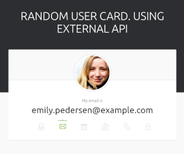

# 🪧 Using API

## 📋 About

2023-02-28 homework.

Learning fetch and use data from external API
**API used**: [https://randomuser.me/](https://randomuser.me/). Design taken from api only for learning purposes.

🌐 **Site published at**: [https://codevivi.github.io/using-api-random-user-card](https://codevivi.github.io/using-api-random-user-card)

🎯 **Goals:**

- [x] Replicate random user business card, as on "randomuser.me" api front page.
- [x] To change information use mouseenter and mouseleave events.
